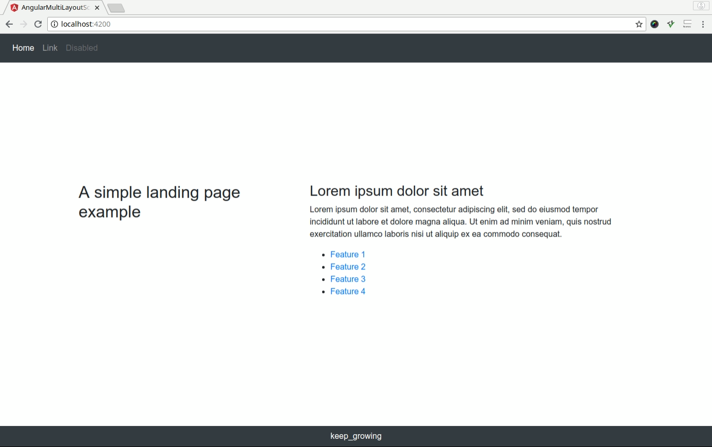
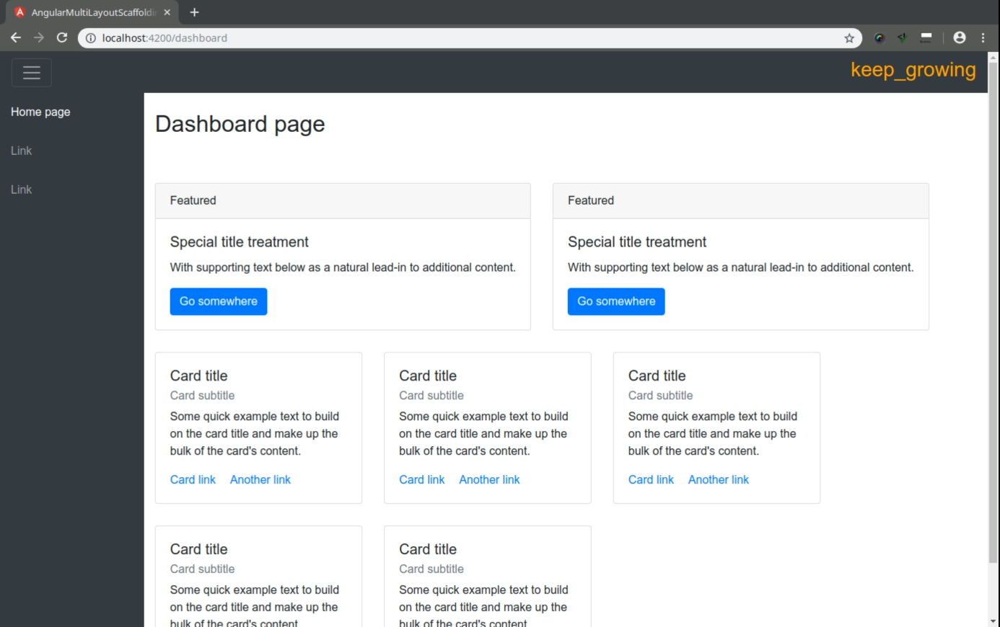

# angular-multi-layout-scaffolding


To learn how to set up a project like this one, check out the [Apply multi-layout to an Angular app](http://keepgrowing.in/angular/apply-multi-layout-to-an-angular-app/) post.

This application serves two separate layouts - one provided on a landing page view, the other used on a dashboard view. There is a horizontal navigation and a footer on the landing page and a vertical navigation on a dashboard.

All views are complemented with Bootstrap classes.




## Getting Started

To clone the repository, run in the command line:
```bash
$ git clone https://github.com/little-pinecone/angular-multi-layout-scaffolding.git
```

## Development server

Run `ng serve` for a dev server. Navigate to `http://localhost:4200/`. The app will automatically reload if you change any of the source files.

## Build

Run `ng build` to build the project. The build artifacts will be stored in the `dist/` directory. Use the `--prod` flag for a production build.

## Running unit tests

Run `ng test` to execute the unit tests via [Karma](https://karma-runner.github.io).

## Built With

* [Angular 8](https://angular.io/)
* [Bootstrap 4](https://getbootstrap.com/)

## License

This project is licensed under the MIT License - see the [license details](https://opensource.org/licenses/MIT).
